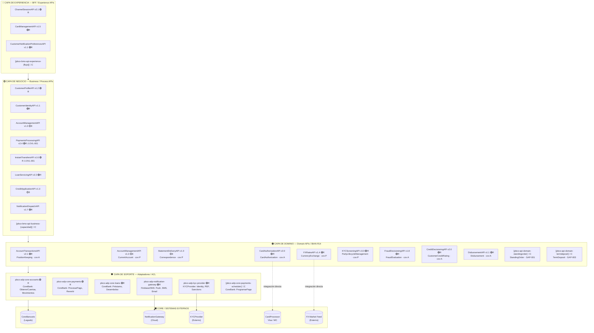
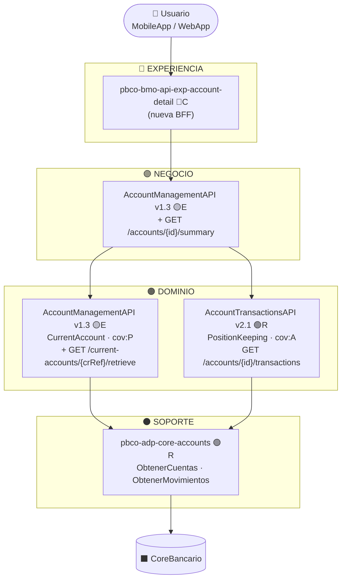
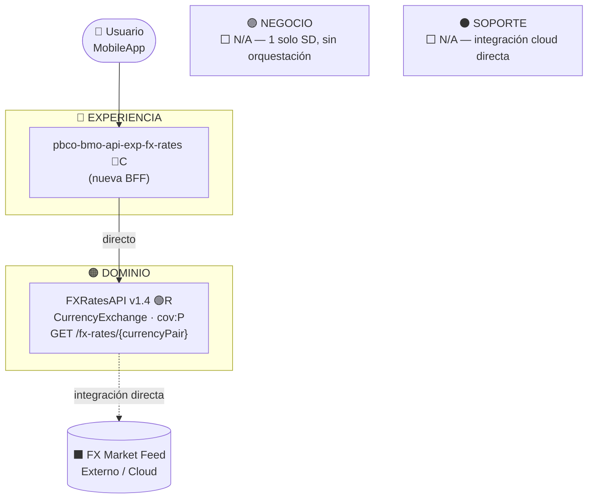
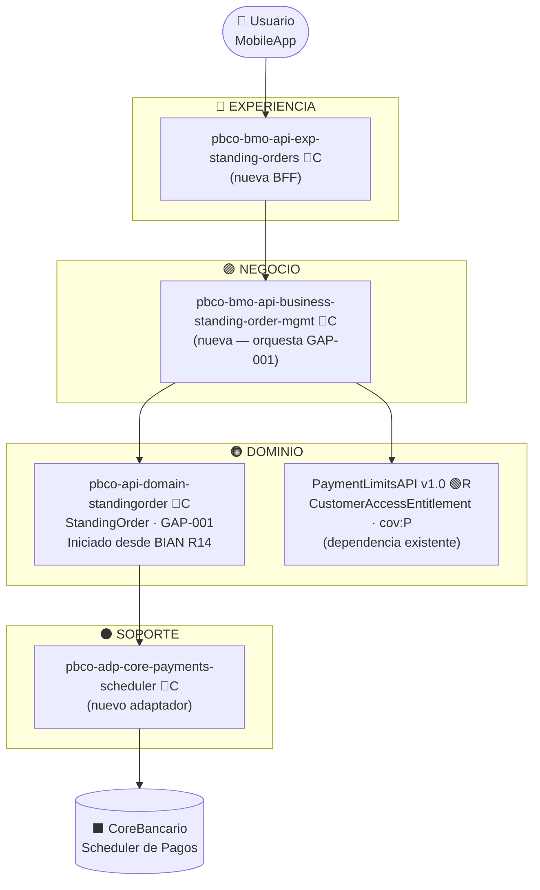
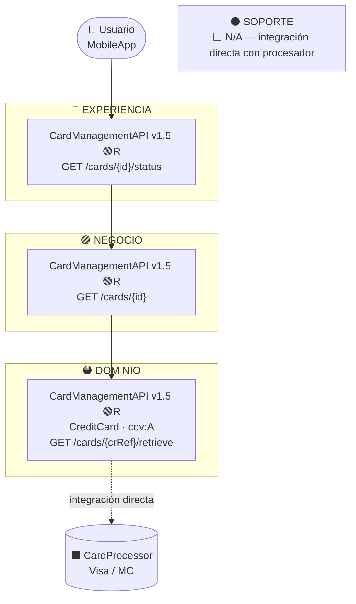

# API Landscape — Diagrama por Capas
<!-- Versión: 1.0 | Fecha: 2026-06 -->
<!-- Responsabilidad: visualización del landscape arquitectural por capas -->
<!-- Inventario de APIs: architecture/context/api-landscape-inventory.yaml -->
<!-- Escenarios:         architecture/context/api-landscape-scenarios.md -->

Este diagrama muestra la arquitectura por capas del landscape de APIs del banco,
con las decisiones de reutilización (`R`), extensión (`E`) y creación (`C`)
aplicadas sobre cada componente.

**Leyenda de decisiones:**
- 🟢 `R` = Reutilizar — existe en catálogo, cubre el caso
- 🟡 `E` = Extender — existe pero requiere nuevo endpoint backward-compatible
- 🔴 `C` = Crear — GAP confirmado, no existe en catálogo
- ⬜ `N/A` = La capa no aplica para este flujo

---

## Diagrama completo del landscape (todas las APIs del catálogo)



---

## Escenario A — Diagrama: Consultar cuenta + movimientos (4 capas activas)



---

## Escenario B — Diagrama: Consulta FX simple (business N/A, support N/A)



---

## Escenario C — Diagrama: Standing Orders / GAP total (todo se crea)



---

## Escenario D — Diagrama: Consultar tarjeta (reutilización total)



---

## Escenario E — Diagrama: Notificaciones event-driven (experience N/A, domain N/A)

```mermaid
flowchart TD

  EVT(["⚡ Evento Interno\n(PaymentsAPI, LoanAPI, etc.)"])

  EXP["🔵 EXPERIENCIA\n⬜ N/A — no hay usuario iniciador"]

  subgraph BUS["🟣 NEGOCIO"]
    B1["NotificationDispatchAPI v1.7 🟢R\nPOST /notifications/dispatch"]
  end

  DOM["🟠 DOMINIO\n⬜ N/A — cov:N, capacidad propietaria"]

  subgraph SUP["⚫ SOPORTE"]
    S1["pbco-adp-notification-gateway 🟢R\nSendPush · SendSMS · SendEmail"]
  end

  GW[("⬛ NotificationGateway\nFirebase / AWS SNS")]

  EVT --> B1
  B1 --> S1
  S1 --> GW
